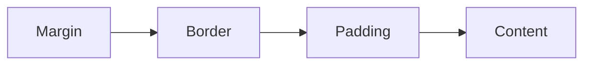

# CSS

## Selectors

- ### Types of selectors

	```css
	*{}			/* Universal selector */
	div{}		/* Type selector */
	.class{}	/* Class selector */
	#id{}		/* ID selector */
	```
- ### Chaining selectors

	Chain selectors without separation to target elements with multiple classes.

	Example:
	
	```html
	<div>
	  <div class="subsection header">Latest Posts</div>
	  <p class="subsection preview">This is where a preview for a post might go.</p>
	</div>
	```
	```css
	.subsection.header {	/* No space */
	  color: red;
	}
	```
	This targets elements only with both `subsection` and `header` classes.

	You can also chain a class and an ID:
	
	```css
	.subsection#preview {
	  color: blue;
	}
	```

	- **Limitations**
	Cannot chain more than one type selector (e.g., `divp` is invalid).

- ### Descendant Combinator
	Uses a space between selectors to indicate a relationship.

	Example:
	
	```html
	<div class="ancestor">
		<!-- A -->
		<div class="contents">
			<!-- B -->
			<div class="contents"><!-- C --></div>
		</div>
	</div>
	
	<div class="contents"><!-- D --></div>
	```
	```css
	.ancestor .contents {
	  /* some declarations */
	}
	```
	
	This selects `.contents` elements (B and C) inside `.ancestor`, not D.
	> `.ancestor > .child ` , child combinator, does the same thing

	You can use multiple combinators:
	
	```css
	.one .two .three .four {
	  /* some declarations */
	}
	```
	This targets `.four` inside `.three`, inside `.two`, inside `.one`. Avoid excessive nesting for clarity and specificity issues.
	> For more info, [refer this](https://www.theodinproject.com/lessons/foundations-intro-to-css#chaining-selectors).

- ### Inheritance
	Typography-based properties (`color`, `font-size`, `font-family`, etc.) are usually inherited, while most other properties aren’t.

## Specificity, the Cascade

Sort of like a tie-breaker, when an element has multiple, conflicting declarations targeting it.  
- Inline style > ID selector > Class Selector > Type selector > Universal selector
- If specificity is the same, then whichever rule was the _last_ defined is the winner


## The Box Model



- ### Standard Box Model
	Here, if we set `width` and `height`, they are applied to only content box. 
- ### Alternate Box Model
	Here, if we set `width` and `height`, they are applied to the visible box on the page, i.e. `content + padding + border`. 
	
	```css
	html {
	  box-sizing: border-box;
	}
	*,
	*::before,
	*::after {
	  box-sizing: inherit;
	}
	```
	We use this box model more frequently, because it's easier to work with.
	> For more info, [refer this](https://developer.mozilla.org/en-US/docs/Learn/CSS/Building_blocks/The_box_model#the_standard_css_box_model).


## Margins

> For more details, [refer this](https://css-tricks.com/almanac/properties/m/margin/).
- ### Auto
	- Tells the browser to define the margin for you.
	- In most cases, a value of `auto` will be equivalent to a value of `0` or else whatever space is available on that side of the element.
	- Handy for horizontal centering.

- ### Collapsing Margins
	- Vertical margins (only `top` and `bottom`) on different elements that touch each other (thus have no content, padding, or borders separating them) will collapse, forming a single margin that is equal to the greater of the adjoining margins.
	- They prevent empty elements from adding extra, usually undesirable, vertical margin space, and they allow for a more consistent approach to declaring universal margins across page elements.


	```html
	<h2>Collapsing Margins</h2>
	<div><p>Example Text</p></div>
	```
	```css
	h2 {
	  margin: 0 0 20px 0;
	}
	div {
      margin-top: 40px;  
	}
	p {
      margin-top: 30px;
	}
	```
	Common sense would suggest that the total vertical margin space here would be 90px (20px + 40px + 30px), but instead the margins all collapse into a single 40px margin (the highest of the three).

- ### Negative Margins
	While a positive margin value pushes other elements away, a negative margin will either pull the element itself in that direction, or pull other elements toward it.
	

## Block and Inline

`block` and `inline` are **outer display types**.

> [**Normal Flow**](https://developer.mozilla.org/en-US/docs/Learn/CSS/CSS_layout/Normal_Flow) is the way that Block and Inline elements are displayed on a page by default before any changes are made to their layout.

-  ### Block
	-   The box will break onto a new line.
	-   The `width` and `height` properties are respected.
	-   Padding, margin and border will cause other elements to be pushed away from the box.
	-   If `width` is not specified, the box will extend in the inline direction to fill the space available in its container. In most cases, the box will become as wide as its container, filling up 100% of the space available.
	- Some HTML elements, such as `<h1>` and `<p>`, use `block` as their outer display type by default.

- ### Inline
	-   The box will not break onto a new line.
	-   The `width` and `height` properties will not apply.
	-   Top and bottom padding, margins, and borders will apply but will not cause other inline boxes to move away from the box.
	-   Left and right padding, margins, and borders will apply and will cause other inline boxes to move away from the box.
	- Some HTML elements, such as `<a>`, `<span>`, `<em>` and `<strong>` use `inline` as their outer display type by default.

- ### Inline-block
	- Midway between block and inline.
	- The box will not break into a new line.
	-  The `width` and `height` properties are respected.
	- Both top-bottom, left-right padding, margins, and borders will apply and will cause other inline boxes to move away from the box.
	- Useful tool to know about, but in practice, you’ll probably end up reaching for flexbox more often if you’re trying to line up a bunch of boxes.

## Flexbox

> Flex [Visual Cheatsheet](https://flexbox.malven.co/)

Flexbox is an **inner display type** (`flex` and `inline-flex`) to arrange items into rows or columns. These items will **flex (i.e. grow or shrink)** based on some rules that you can define.

```html
<div class="flex-container">
  <div class="one"></div>
  <div class="two"></div>
  <div class="three"></div>
</div>
```
```css
.flex-container {
  display: flex;
}
.flex-container div {
  background: peachpuff;
  border: 4px solid brown;
  height: 100px;
  flex: 1;
}
```
- ### Flex Shorthand
	```css
	flex: <flex-grow> <flex-shrink> <flex-basis>
	```
	 
- ### Flex Types
	> [This scrim](https://v2.scrimba.com/learn-flexbox-c0k/~09) explains flex-grow, flex-shrink, flex-basis really well.


	 **`flex: 1`  --> `flex: 1 1 0`** sizes the item based on the `width` / `height` properties. 
	
	**`flex: initial` --> `flex 0 1 auto`** sizes the item based on the `width` / `height` properties. It shrinks to its minimum size to fit the container, but does not grow to absorb any extra free space in the flex container.
 
	 **`flex: auto`  --> `flex: 1 1 auto`** sizes the item based on the `width` / `height` properties, but makes them *fully flexible*, so that they absorb any free space by growing along the *main axis* (`flex-direction`), and shrinks to its minimum size to fit the container.
 
	 **`flex: none` --> `flex: 0 0 auto`** sized according to its `width` / `height` properties. Makes it *fully inflexible*. Neither shrinks nor grows.
 
	 **`flex: <positive-number>` --> `flex: <positive-number> 1 0`** receives the specified proportion
	> For more details, [refer this](https://developer.mozilla.org/en-US/docs/Web/CSS/flex).


- ### Flex Grow
	`flex-grow` expects a single number as its value, and that number is used as the flex-item’s “growth factor”. When we applied `flex: 1` to every div inside our container, we were telling every div to grow the same amount. The result of this is that every div ends up the exact same size. If we instead add `flex: 2` to just one of the divs, then that div would grow to 2x the size of the others.

- ### Flex Shrink
	`flex-shrink` is similar to `flex-grow`, but sets the “shrink factor” of a flex item. `flex-shrink` only ends up being applied if the size of all flex items is larger than their parent container.

	For example, if our 3 divs from above had a width declaration like: `width: 100px`, and `.flex-container` was smaller than `300px`, our divs would have to shrink to fit.

	The default shrink factor is `flex-shrink: 1`, which means all items will shrink evenly. If you do _not_ want an item to shrink then you can specify `flex-shrink: 0;`.
	> While using flex-shrink make sure to set `flex-basis: auto` and give a width to the element.

- ### Flex Basis
	> [Chatgpt conversation](https://chatgpt.com/c/0df2e3c4-220e-44b2-8ff8-3a981fe01621) for reference.
	
	Specifies the initial main size of a flex item before any space distribution takes place. It overrides the `width` or `height` properties of a flex item.


	```css
	.item {
	  flex-basis: <length> | auto | initial | inherit; }
	```
	
	-   **\<length\>**: A specific size (e.g., `10px`, `50%`, etc.). This sets the initial size of the flex item to the given length.
	-   **auto**: The default value. The size is determined by the item's content and any `width` or `height` properties.
	-   **initial**: Sets the property to its default value (which is `auto`).
	-   **inherit**: The value is inherited from the parent element.
		> Default `flex-basis: auto` , but while using `flex: 1`, it sets `flex-basis: 0`

	
- ### Axes
	
	There are two axes or `flex-direction`,
	- `row` or horizontal (default)
	- `column` or vertical
	> While using `row`,  `flex-basis` refers to `width`,
	> but in case of colum it refers to `height`.
	>
	> So using `flex: 1` causes problem in `column`, setting `flex-basis: 0`.


- ### Alignment
	All about `align-items` (cross axis) and `justify-content` (primary axis). Additionaly `align-items`, `align-content`, `align-self`.
	> [Refer this](https://css-tricks.com/snippets/css/a-guide-to-flexbox/) for a quick recap. The images and examples are super helpful.

	> [Refer this](https://www.joshwcomeau.com/css/interactive-guide-to-flexbox/) for a comprehensive guide. GOATed resourse. covers everything one needs to know about flexbox.

- ### Order
	By default, flex items are laid out in the source order. However, the `order` property controls the order in which they appear in the flex container.
	```css
	.item{
	  order: 69;	/* can be -ve also */
	}
	```
	the itmes are arranged in ascending  `order`. Items with the same `order` revert to source order.
	> Refer [this codepen](https://codepen.io/akashshaw/pen/yLWoYwM) for example.

- ### Wrapping
	`flex-wrap: wrap` divides the flex into multiple main axes based on `flex-basis`
	```css
	.container{
	  flex-wrap: nowrap | wrap | wrap-reverse;
	}
	```
	> For details, [refer this](https://www.joshwcomeau.com/css/interactive-guide-to-flexbox/#wrapping-14).

- ### Gap
	The gap property explicitly controls the space between flex items. It applies that spacing only between items not on the outer edges.
	```css
	.container{
	  gap: 10px;
	  gap: 10px 20px; /* row-gap column gap */
	  row-gap: 10px;
	  column-gap: 20px;
	}
	```

- ### When to use flexbox?
	> For a detailed guide, [refer this](https://developer.mozilla.org/en-US/docs/Web/CSS/CSS_Flexible_Box_Layout/Typical_Use_Cases_of_Flexbox).
	- When we want to lay a collection of items out in one direction or another.
		>For working with multiple rows and columns and larger layouts grid may be a better option.
	- [Navbars](https://www.joshwcomeau.com/css/interactive-guide-to-flexbox/#auto-margins-13) (The ideal flexbox usecase)
	- [Centering](https://developer.mozilla.org/en-US/docs/Web/CSS/CSS_flexible_box_layout/Typical_use_cases_of_flexbox#center_item) a single item
	- [Card layouts](https://developer.mozilla.org/en-US/docs/Web/CSS/CSS_Flexible_Box_Layout/Typical_Use_Cases_of_Flexbox#card_layout_pushing_footer_down) pushing footer down
	- [Media objects](https://developer.mozilla.org/en-US/docs/Web/CSS/CSS_flexible_box_layout/Typical_use_cases_of_flexbox#media_objects) (an image or other element to one side and text to the right)
	- [Responsive forms](https://www.joshwcomeau.com/css/interactive-guide-to-flexbox/) without using media queries


## Normalize css

### Normalize vs Reset vs Hybrid

- Normalize generally makes the style uniform throughout the browsers
- Reset makes the webpage a blank slate to style it with css, removing defualt browser styling entirely
- Somewhere between reset and normalize

### Good resources

- [normalize.css](https://github.com/necolas/normalize.css) - most popular one
- [modern-normalize](https://github.com/sindresorhus/modern-normalize) - highly recommended
- Tailwind uses [preflight](https://tailwindcss.com/docs/preflight)
- [Eric Meyer's CSS reset](https://meyerweb.com/eric/tools/css/reset/) - but it's OLD
- [Josh Comeau's CSS reset](https://www.joshwcomeau.com/css/custom-css-reset/#the-css-reset-1)
- [Browser default styles](https://browserdefaultstyles.com/)


### Undo a reset

use `revert` keyword

```css
.article :where(h1, h2, h3, h4, h5) {
  all: revert;
}
```
Within an `.article`, headings are displayed using the original browser default styles, with appropriate font sizes and weights, thanks to `revert`


## CSS Units
> [List](https://developer.mozilla.org/en-US/docs/Learn_web_development/Core/Styling_basics/Values_and_units) of all the units

- `1px` is 1/96th of an inch. Not the length of a physical pixel
-  `1rem` is the `font-size` of the root element (either `:root` or `html`). (preferred unit) (Most of the time 16px)
- `1em` is the `font-size` of an element (or the element’s parent if you’re using it to set `font-size`)
- `1ch` is width of `0`
- `1vmin`/`1vmax` is 1% of the viewport width or height, whichever is smaller/larger
#### Use Cases
- `vh`,`vw` for hero elements
- `rem` for font size
- `%` for width generally, with `max-width`
- `ch` for `<p>` width (don't go over `75`, `45`-`55` is a good number)
- Generally do not specify `height`, if absolutely needed use `min-height`
- may use `em` for button padding
- may use `px` for other margin padding, but its highly subjective, check [here](https://codepen.io/codyloyd/pen/mdOXeMX)

## Fonts


### Fallback font
- CSS trick's [system font stack](https://css-tricks.com/snippets/css/system-font-stack/)
	```css
	body {
	  font-family: system-ui, "Segoe UI", Roboto, Helvetica, Arial, sans-serif, "Apple Color Emoji", "Segoe UI Emoji", "Segoe UI Symbol";
	}
	```

### Self-hosted fonts
- Using google fonts [violates European GDPR](https://thehackernews.com/2022/01/german-court-rules-websites-embedding.html)
- All major browsers support woff
- Find fonts here, [font squirrel](https://www.fontsquirrel.com/fonts/list/hot_web), [dafont](https://www.dafont.com/)
```css
@font-face {
    font-family: "Open Sans";
    src: url("/fonts/OpenSans-Regular-webfont.woff2") format("woff2");
    unicode-range: U+0025-00FF;
}

h1 {
  font-family: my-cool-font, sans-serif;
}
```

### Style norms
- Use `line-height: 1.5` for better readability and accesibility
- Dn't have more than 75 characters per line

### text styles
- `text-transform: capitalize/uppercase/lowercase/none/full-width/etc` 
- ellipsis ( ... at overflow )
	```css
	.overflowing {
	  white-space: nowrap;
	  overflow: hidden;
	  text-overflow: ellipsis;
	}
	```
### Best practices
- Use preconnect while using external source, using `<link>` is more preferred than `@import`
	```html
	<head>
	  <link rel="preconnect" href="https://fonts.googleapis.com">
	  <link rel="preconnect" href="https://fonts.gstatic.com" crossorigin>
	</head>
	```
- [Dynamic font size](https://web.dev/learn/design/typography#text_size)
	```css
	article {
	  font-size: clamp(1rem, 0.75rem + 1.5vw, 2rem);
	  max-inline-size:  66ch;
	  line-height: 1.65;
	}
	```

