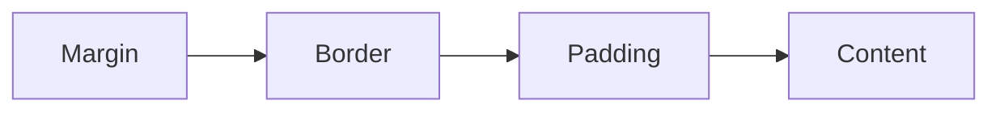

  # CSS

## Selectors
- ### Types of selectors :
	```css
	*{}			/* Universal selector */
	div{}		/* Type selector */
	.class{}	/* Class selector */
	#id{}		/* ID selector */
	```
- ### Chaining selectors :

	Chain selectors without separation to target elements with multiple classes.

	Example:
	```html
	<div>
	  <div class="subsection header">Latest Posts</div>
	  <p class="subsection preview">This is where a preview for a post might go.</p>
	</div>
	```
	```css
	.subsection.header {	/* No space */
	  color: red;
	}
	```
	This targets elements only with both `subsection` and `header` classes.

	You can also chain a class and an ID:
	```css
	.subsection#preview {
	  color: blue;
	}
	```

	- **Limitations**
	Cannot chain more than one type selector (e.g., `divp` is invalid).

- ### Descendant Combinator :
	Uses a space between selectors to indicate a relationship.

	Example:
	```html
	<div class="ancestor">
		<!-- A -->
		<div class="contents">
			<!-- B -->
			<div class="contents"><!-- C --></div>
		</div>
	</div>
	
	<div class="contents"><!-- D --></div>
	```
	```css
	.ancestor .contents {
	  /* some declarations */
	}
	```
	This selects `.contents` elements (B and C) inside `.ancestor`, not D.
	> `.ancestor > .child ` , child combinator, does the same thing

	You can use multiple combinators:
	```css
	.one .two .three .four {
	  /* some declarations */
	}
	```
	This targets `.four` inside `.three`, inside `.two`, inside `.one`. Avoid excessive nesting for clarity and specificity issues.
	> For more info, [refer this](https://www.theodinproject.com/lessons/foundations-intro-to-css#chaining-selectors).


- ### Specificity, the Cascade :

	Sort of like a tie-breaker, when an element has multiple, conflicting declarations targeting it.  
	- Inline style > ID selector > Class Selector > Type selector > Universal selector
	- If specificity is the same, then whichever rule was the _last_ defined is the winner
- ### Inheritance :
	Typography-based properties (`color`, `font-size`, `font-family`, etc.) are usually inherited, while most other properties aren’t.
	
	

## The Box Model



- ### Standard Box Model
	Here, if we set `width` and `height`, they are applied to only content box. 
- ### Alternate Box Model
	Here, if we set `width` and `height`, they are applied to the visible box on the page, i.e. `content + padding + border`. 
	```css
	html {
	  box-sizing: border-box;
	}
	*,
	*::before,
	*::after {
	  box-sizing: inherit;
	}
	```
	We use this box model more frequently, because it's easier to work with.
	> For more info, [refer this](https://developer.mozilla.org/en-US/docs/Learn/CSS/Building_blocks/The_box_model#the_standard_css_box_model).


## Block and Inline

`block` and `inline` are **outer display types**.

> [**Normal Flow**](https://developer.mozilla.org/en-US/docs/Learn/CSS/CSS_layout/Normal_Flow) is the way that Block and Inline elements are displayed on a page by default before any changes are made to their layout.

-  ### Block
	-   The box will break onto a new line.
	-   The `width` and `height` properties are respected.
	-   Padding, margin and border will cause other elements to be pushed away from the box.
	-   If `width` is not specified, the box will extend in the inline direction to fill the space available in its container. In most cases, the box will become as wide as its container, filling up 100% of the space available.
	- Some HTML elements, such as `<h1>` and `<p>`, use `block` as their outer display type by default.

- ### Inline
	-   The box will not break onto a new line.
	-   The `width` and `height` properties will not apply.
	-   Top and bottom padding, margins, and borders will apply but will not cause other inline boxes to move away from the box.
	-   Left and right padding, margins, and borders will apply and will cause other inline boxes to move away from the box.
	- Some HTML elements, such as `<a>`, `<span>`, `<em>` and `<strong>` use `inline` as their outer display type by default.

- ### Inline-block
	- Midway between block and inline.
	- The box will not break into a new line.
	-  The `width` and `height` properties are respected.
	- Both top-bottom, left-right padding, margins, and borders will apply and will cause other inline boxes to move away from the box.
	- Useful tool to know about, but in practice, you’ll probably end up reaching for flexbox more often if you’re trying to line up a bunch of boxes.